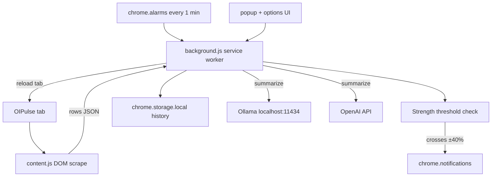

# OIPulse Strength Alert Chrome Extension

## Goal

Chrome extension (Manifest V3) that:

1. Scrapes the full Trending OI table from the open [OIPulse page](https://oipulse.com/app/options-analysis/trending-oi) into JSON
2. Every minute: refreshes that tab, re-scrapes, and notifies if **first-row Strength** is `> 40%` or `< -40%`
3. Summarizes the table as a **2-hour dataframe** using **Ollama** (`http://localhost:11434`) by default, with optional **OpenAI** (API key in settings)

## Architecture



**Chosen approach:** content-script DOM scrape (page must stay open and logged in). Background owns scheduling, reload, alerts, LLM calls.

## Project layout

```
oipulse-strength-alert/
├── plan.md
├── manifest.json
├── background.js
├── content.js
├── popup.html
├── popup.js
├── popup.css
├── options.html
├── options.js
├── options.css
├── lib/
│   ├── parse.js
│   ├── summarize.js
│   └── llm.js
├── icons/
│   ├── icon16.png
│   ├── icon48.png
│   └── icon128.png
└── README.md
```

Vanilla JS (no bundler) — load unpacked from `chrome://extensions`.

## Step 1 — Manifest V3

- Permissions: `storage`, `alarms`, `notifications`, `tabs`, `scripting`
- Host permissions: `https://oipulse.com/*`, `http://localhost:11434/*`, `https://api.openai.com/*`
- Content script on trending-oi URL
- Service worker + popup + options page

## Step 2 — Content script: table → JSON

1. Locate the Trending OI table (resilient selectors + fallback).
2. Read headers → normalized field keys.
3. Parse Indian numbering and Strength percentages.
4. Messages: `SCRAPE_TABLE`, `GET_FIRST_STRENGTH`.

## Step 3 — Minute loop: refresh → scrape → alert

1. `chrome.alarms` every 1 minute.
2. Reload OIPulse tab, wait for load, scrape.
3. Alert if first-row Strength outside ±40% (configurable).
4. Dedupe via `lastAlertKey = date|time|strength`.

## Step 4 — Popup UI

Monitoring toggle, last scrape / strength / sentiment, Scrape now, Summarize 2h, status, link to Options.

## Step 5 — Options: dual LLM

Ollama (default) + OpenAI with API key in `chrome.storage.local`. Thresholds and connection test.

## Step 6 — 2-hour summarization

Bucket rows into NSE-aligned 2h windows, aggregate metrics, prompt Ollama or OpenAI, show summary in popup.

## Step 7 — Messaging contract

| Message | From → To | Purpose |
|---------|-----------|---------|
| `SCRAPE_TABLE` | background → content | Full table JSON |
| `GET_STATUS` | popup → background | Last scrape + strength |
| `SET_MONITORING` | popup → background | Enable/disable alarm work |
| `SUMMARIZE_2H` | popup → background | Run bucket + LLM |
| `TEST_LLM` | options → background | Ping Ollama / OpenAI |

## Step 8 — Manual test checklist

- Load unpacked; scrape returns full row count
- Strength outside ±40% → one notification (no spam)
- ~1 min: tab reloads and scrape updates
- Ollama / OpenAI summaries work; bad key shows clear error

## Risks / constraints

- DOM selectors may break on site redesign
- Use `chrome.alarms`, not `setInterval`
- Page must be open and authenticated
- Ollama needs `OLLAMA_ORIGINS=chrome-extension://*`
- Never commit OpenAI API keys
